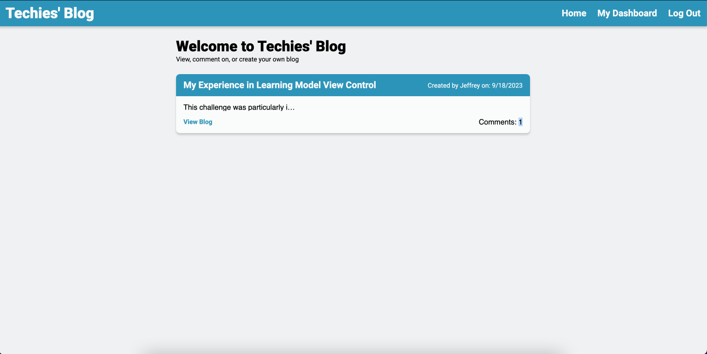

## Techies' Blog

## Description

Do you ever find yourself with thoughts that you would like to share with others but don't have a way to connect? Maybe you have some knowledge on a certain subject that you want to share with others. Maybe you want to make a statement and start a conversation.

Techies' blog allows you to do just that. Create an account and send a message to anyone that is will to lend the time to read what you have to say. Users can also comment on your thoughts as well as you on theirs.

Maybe you made a mistake.. No worries. Authors of blog posts can update their contents, even delete them.

Whatever is on your mind you can share it with the world with Techies' blog

## Table of Contents

- [Installation](#installation)
- [Usage](#usage)
- [Credits](#credits)
- [License](#license)
- [Assets](#assets)

## Installation

Contributors will need to install all packages which includes;

- bcrypt = for password hashing
- connect-session-sequelize = connects the current users session with the database
- dotenv = stores variables for the test enviroment
- express = main server
- express-session = allows for setting state of session
- express-handlebars = for creating html templates
- mysql2 = for database management
- sequelize = syncs the database with the application

## Usage

User will need to use mysql to access create the database.

1. `SOURCE db/schema.sql`

Next user will need to seed the database with provided example content 2. `npm run seed`

User will then need to start the application 3. `npm start`

## Credits

- Jeffrey Gunn - Full Stack devoloper

## License

There is no license for this application

## Assets

- github repository - https://github.com/jsgunn22/techies-blog
  
